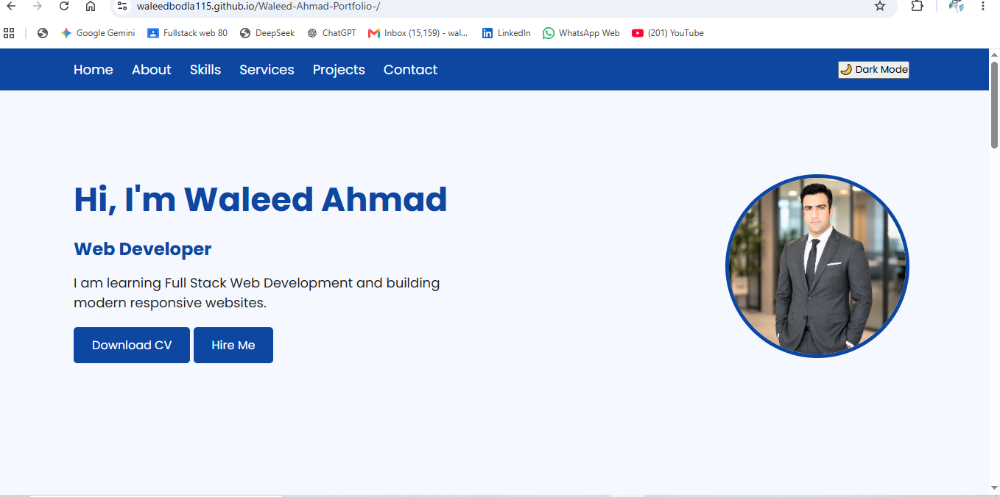

# Waleed Ahmad | Front-End Developer Portfolio

Welcome to my personal portfolio website.

I am **Waleed Ahmad**, a Front-End Web Developer passionate about creating modern, responsive, and user-friendly websites. I am currently learning Full Stack Web Development and improving my skills through real-world projects.

## 🚀 Live Website

🌐 https://waleedbodla115.github.io/Waleed-Ahmad-Portfolio-/

## 🛠️ Technologies Used

- HTML5
- CSS3
- JavaScript
- Git
- GitHub
- Responsive Web Design

## ✨ Features

✅ Fully responsive design  
✅ Mobile-friendly navigation  
✅ Dark mode functionality  
✅ Smooth scrolling  
✅ Contact form interaction  
✅ Modern UI design  
✅ Project showcase section  

## 📂 Projects

### 💻 Portfolio Website

My personal developer portfolio built using:

- HTML
- CSS
- JavaScript

Features:
- Responsive layout
- Dark mode
- Animated sections

### 🛒 E-commerce Website

A modern shopping website design created to practice:

- Website layout
- Product sections
- Responsive design

### 🌐 Landing Page

A responsive business landing page focusing on:

- Clean UI
- Modern design
- User experience

## 📈 Learning Journey

Currently improving my skills in:

- JavaScript
- React.js
- Next.js
- TypeScript

## 📞 Contact

GitHub:
https://github.com/Waleedbodla115

Email:
waleedusman91@gmail.com

---

© 2026 Waleed Ahmad | Front-End Developer